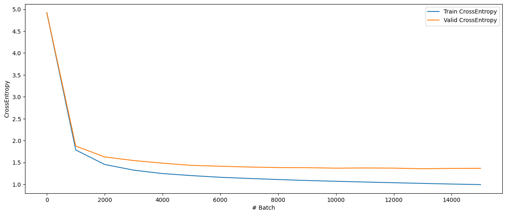
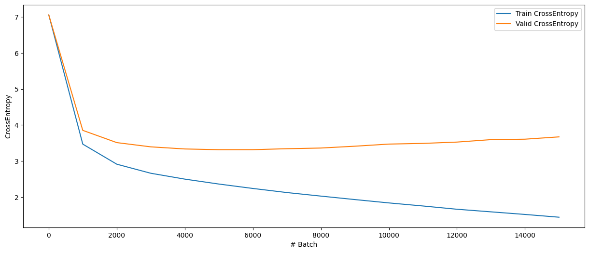

# Nano-GPT-karpathy
- This is  a simple implementation of Nano GPT. It is based on Andrej Karpathy Nano GPT repository. 
https://github.com/karpathy/nanoGPT
- In this project, three types of tokenizers were written from scratch. Unigram tokenizer, BPE tokenizer, Simple char tokenizer. Unigram tokenizer implementation is based on my own repository - https://github.com/DmitryAsdre/UnigramTokenization. There you can find some theoretical details about Unigram Tokenizer implementation
- A collection of Shakespeare's works was used as a training sample. This is about 6 million characters. For my capacities, these are almost the maximum values.
## Quick project overview
- `./data/` - Shakespeare's texts.
- `./code/nano_gpt_overview.ipynb` - jupyter notebook with an overview of trained models and their losses.
- `./code/train_nano_gpt*.py` - python scripts, that has been used to train models with different tokenizers.
- `./code/nano_gpt` - Nano GPT implementation
- `./code/tokenizers` - Unigram tokenizer, BPE tokenizer and Simple Char tokenizer implementation
## Generation examples
### Nano GPT, 40M parameters, Simple Char tokenizer
350 tokens
```
OTHELLO.
Have you pray'd to-night, Desdemona?

DOGBERRY.
They are in Egliamond mean of chastity.

IAGO.
O, Desdemona demeans of many of a joy.

BARDOLPH.
You rag of mine own lazy prevaises for a sin-unlikely stomach,
and let me entertain you.

SUFFOLK.
[_Aside_.] Ay, I were ask’d.

OTHELLO.
Ay, sir, ambask’d within me, and would speech you:
tells you have. I have not been completers in your br
```
### Nano GPT, 40M parameters, BPE tokenizer
350 tokens
```
OTHELLO.
Have you pray'd to-night, Desdemona?

DESDEMONA.
A true, having my Leonato, had a death,
But rather cares serve and filk for a ken.
A moor! Honest thou wilt set thine eyes;
Stand what mayst I should wake a warm?

DESDEMONA.
Ay, and ordain, and having but a merry man’s ink,
Why should be spent to find out man knows:
[_To Marina._] ‘Yet gloving before ’twas, ’twas the reckoning;
He was leagued to smell before the peep!
Cleam. Come, for our niece! let her have one words?

DEMETRIUS.
Not for my life; it was.

[_Exit Caesar._]

OTHELLO.
Such uncle!

CAESAR.
Proceed I hie down, for wheresoe now
I saw the shore to suppress with the teyr.

[_Laspit and Frenchdoreto bloody Kate._]

How now, Kate!

OTHELLO.
Did what art thou? Look how far beating levy?

DESDEMONA.
I, pardon.

OTHELLO.
He needs out
```
### Nano GPT, 40M parameters, Unigram tokenizer
350 tokens
```
OTHELLO.
Have you pray'd to-night, Desdemona?

BEATRICE.
Yes, ye do the shrieken lady, and he hath laid up me in talk. But be not as
admir point, but troubled, as you repay, as you can, I, lay acheer in
his self-house.

LEONATO.
Why, how, brother? O God! a fool! you talk of rhlanders? Who is there?

FABIAN.
She will then dispose return a shirt in her; and will he see how Caesar earth, and
be two here. I hope the Prince has fallen enough, Balthaudlas?

BENEDICK.
Let me speak.

LEONATO.
But what talk you?

BEATRICE.
There is nothing matters, though particular men against ears, is enterly
pitiful sheen where they did; only, you are wear reward if you have
famish, you would desire yourself—leven, my lord,
Well he must be no answer.

HERO.
Why, sir, will thy tongue marry her?

BEATRICE.
Surely, with what tongue you heard else?

BEATRICE.
I would he see, but think truthly, for any man should play
well a cause of better.

LEONATO.
In such a doubt of an arren, of jealousy, that is a woman in Ch
```
## Train/Val losses
### Nano GPT, 40M parameters, Simple Char tokenizer

### Nano GPT, 40M parameters, BPE tokenizer

### Nano GPT, 40M parameters, Unigram tokenizer


## Unigram tokenization vs BPE tokenization
Although two different models cannot be directly compared with two different tokenizations, I will still write out a table with crossentropy for the Unigram tokenizer and the BPE tokenizer. They have the same dictionary size - 1000 tokens, and therefore it is interesting to see the results.

|Tokenization Type| CrossEntropy Train | CrossEntropy Val| #Batch |
|-----------------|--------------------|-----------------|--------|
|Unigram          | **2.27**           |   **3.28**      |6000    |
|BPE              | 2.36               |   3.31          |5000    |
